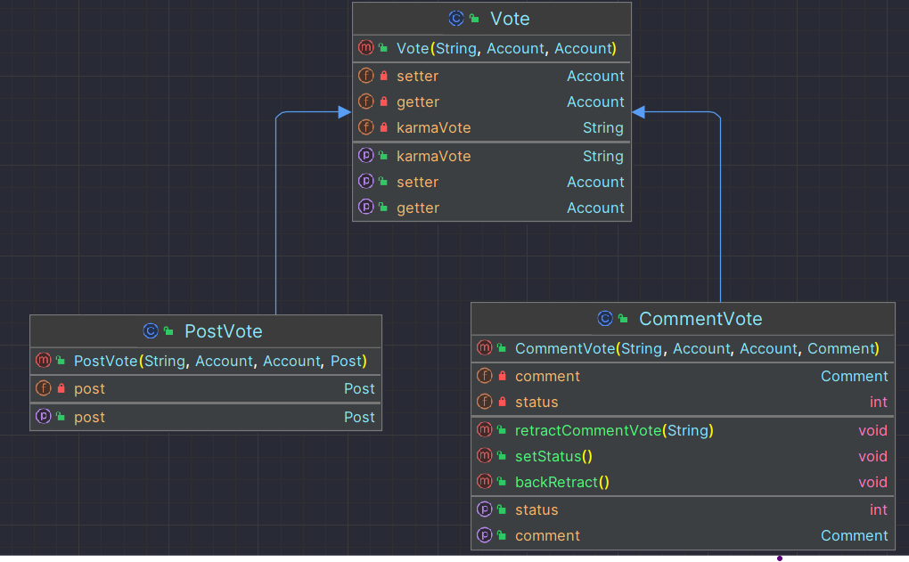

# Project Title

Reddit Terminal Application

## Description

This is a simple Reddit application that allows you to browse Reddit in the terminal. It is built using Java.

## Features

1) Sign Up

2) Login 

3) Create a Subreddit

4) Follow a Subreddit

5) Create Post

6) Leave Comment For Posts

7) Set Karma For Comments or Posts and Rtract it

8) Delete Subreddit/post/comment/follower of subreddits that you are admin of them

9) View a List of All Posts in DataBase

10) View a List of Post For Subreddits or Users You Follow Them

11) Save a Post

12) Add an Admin to a Subreddit

13) Search User or Subreddit By Name

14) Change Your Information Like Username / password / Email

16) View Your Profile

17) Follow a User

18) Create ChatBox and Privately Chat With a User

19) Send a Post In a ChatBox

20) Logout and Login again to Your Account

21) There is a Notification System For New Messages and Followers

22) When User Want to SignUp he/she Must Enter a Captcha Code that Program Create it Randomly

23) Program Use Regex System To Validate Users Emails

24) Program Have a HashPassword System to Validate user Password When he/she Wants to login

25) Users Can Choose that they Eamil be Shown in Their Profile or No

26) unSave a Post

## Installation

1. Clone the Repository

2. Go To src -> main -> java

3. open a terminal or cmd

4. Compile The Java Classes : 

    write <Javac *.java> in the Terminal

5. Run the application:

    java Main

6. Enjoy the program

## Dependencies

To Run This Program You Should Have SomeThing In Your Local Machine:

- Java Development Kit (JDK)
- Gradle 8.6 Version And org.json Library (You can get it with add a Command in Build.gradle File)

### Help

if you cant run the Main.class make sure that you compile all Classes

### Authors

The Only Contributor : 
AmirAli Nasiri 

Github --> https://github.com/amirnasiri23

Gmail --> amirnasiri1383710@gmail.com

## Version History

* 0.1
    * Create a Main Class and initial Commit
* 0.2
    * Create FirstMenu and Signup and login operations
    * Validate Username and Password and Email of user
* 0.3
    * Create a DataBase Class To Save Users Data
    * Create Account Class and AccountManagement Interface
* 0.4 
    * Create Some Options of LoginMenu
    * Create Subreddit Class
    * Create Oprations For Follow and Create subreddits
* 0.5 
    * Create Post Class
    * Create Comment Class
    * Create Operations For Create Post and View All Posts (In All Reddit World(option 3) or In TimeLine(option 4))
* 0.6
    * Create Admin Class Extands Account 
    * Create Abilities of Admins Like Delete Post / Comment
    * Add Ability To Add an Admin To a Subreddit
* 0.7
    * Create Ability For Users To leave Comment For Posts
    * Create Save Post System For Users and Show All Saved Posts
* 0.8
    * Create Profile For Users in Account Class and Alow Them To See It
    * Add a Choice System that user Want his/her Email in profile
* 0.9
    * Create a Search Function To Find Users and Subreddits With Thier Name
* 1.0
    * Create a Function For Change User Information
* 1.1
    * Create Karma System And Allow Users To Set Karma for Posts and Comments
    * Create a System For Users That they can Retract or Chabge Thier Votes
* 1.2
    * Create ChatBoxes that Two User Can Privatly Chat in Them
    * Add post sharing Function To Chatboxes
* 1.3
    * Add Following System that users can Follow other Users
    * Add Followers and Followings in Users Profiles
* 1.4
    * Add a CaptchaCode Creator that Create Captcha Codes When Users Wants To Sign Up
* 1.5
    * Add a Function That Allow Users To UnSave a Post

## Menus (Some Screen Shots of Program at RunTime)

FirstMenu:

LoginMenu:

TimeLineMenu:

## Works Flow

UML of Classes:

## Contributing

Feel free to contribute to this project by submitting a pull request. Bug reports and feature requests are also welcome.